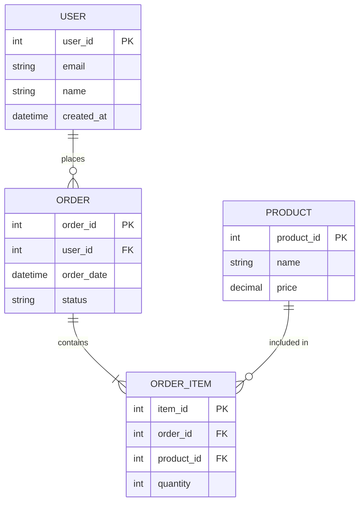

# Software Requirements Specification (SRS)

> 参考: Karl Wiegers "Software Requirements 3rd Edition" Chapter 10

## ドキュメント情報

| 項目 | 内容 |
| --- | --- |
| プロダクト名 | [プロダクト名] |
| バージョン | 1.0 |
| 作成日 | YYYY-MM-DD |
| 最終更新日 | YYYY-MM-DD |
| ステータス | Draft / Review / Approved |
| 承認者 | [氏名・役職] |

---

## 1. Introduction

### 1.1 Purpose（目的）

[このSRSが対象とするプロダクトまたはサブシステムを特定する。リリース番号を含む。対象読者（開発者、PM、テスター、ドキュメントライター等）を記述する。]

### 1.2 Document Conventions（規約）

#### 要件ID規約

要件IDは階層的テキストタグを使用する:

```
Feature.SubFeature.Sequence
例: AUTH.LOGIN.001, ORDER.CART.002, USER.PROFILE.001
```

- 親要件は見出し/機能名として記述し、個別の機能要件としては記述しない
- 子要件の集合が親の機能を実現する
- 要件を削除してもIDは再利用しない

#### 優先度定義

- **Must**: リリースに必須
- **Should**: 重要だが必須ではない
- **Could**: あれば望ましい
- **Won't**: 今回は対象外

#### TBD規約

未確定の情報は以下の形式で記録する:

```
[TBD-nnn: 説明, 担当者, 期限]
```

全TBDは Appendix C に一覧化し、実装前に解決する。

### 1.3 Project Scope（プロジェクトスコープ）

[Vision & Scope Document への参照。ここではスコープの要約のみ記述する。]

参照: [vision-and-scope.md](vision-and-scope.md)

### 1.4 References（参考文献）

| 文書名 | バージョン | 場所 |
| --- | --- | --- |
| Vision & Scope Document | x.x | `docs/requirements/vision-and-scope.md` |
| Business Rules Catalog | x.x | `docs/requirements/business-rules-catalog.md` |
| Context Diagram | x.x | `docs/requirements/context-diagram.md` |
| [その他関連文書] | x.x | [パス/URL] |

---

## 2. Overall Description

### 2.1 Product Perspective（製品の位置付け）

[新規プロダクトか、既存システムの後継か、大規模システムの一部か。コンテキスト図を参照し、システムの位置付けを記述する。]

参照: [context-diagram.md](context-diagram.md)

### 2.2 User Classes and Characteristics（ユーザークラス）

| ユーザークラス | 説明 | 利用頻度 | 技術レベル | 優先度 |
| --- | --- | --- | --- | --- |
| [管理者] | [システム設定・ユーザー管理] | 日次 | 高 | Favored |
| [一般ユーザー] | [業務操作] | 日次 | 中 | Favored |
| [ゲスト] | [閲覧のみ] | 不定期 | 低 | - |

### 2.3 Operating Environment（動作環境）

- **クライアント**: [ブラウザ/OS/デバイス]
- **サーバー**: [OS/ランタイム/コンテナ]
- **データベース**: [RDBMS/バージョン]
- **クラウド**: [AWS/Azure/GCP/オンプレミス]
- **ネットワーク**: [イントラネット/インターネット/VPN]

### 2.4 Design and Implementation Constraints（設計・実装上の制約）

| 制約 | 理由 |
| --- | --- |
| [使用言語: TypeScript] | [既存チームのスキルセット] |
| [フレームワーク: React] | [既存プロダクトとの統一] |
| [データベース: PostgreSQL] | [ライセンスコスト] |

### 2.5 Assumptions and Dependencies（前提条件と依存関係）

[システム機能に関する前提条件。ビジネスレベルの前提は Vision & Scope Document に記載。]

- [前提条件 1]
- [前提条件 2]
- [依存関係: 外部ライブラリ/フレームワーク/サービスなど]

---

## 3. System Features

機能ごとにセクションを繰り返す。個別機能の詳細は `functional/` 配下の個別ファイルに記述してもよい。

### 3.1 [機能名: 例 ユーザー認証]

#### 3.1.1 Description

[機能の概要と優先度]

- 優先度: Must
- 関連ビジネスルール: BR-001, BR-002
- 関連 V&S 機能: FT-001

#### 3.1.2 Functional Requirements

| 要件ID | 要件 | 受入基準 | ソース |
| --- | --- | --- | --- |
| AUTH.LOGIN.001 | メールアドレスとパスワードでログインできる | 正しい認証情報でダッシュボードに遷移する | UC-001 |
| AUTH.LOGIN.002 | 5回連続失敗でアカウントをロックする | 6回目のログイン試行がブロックされる | BR-001 |
| AUTH.LOGOUT.001 | ログアウトでセッションが無効化される | ログアウト後に認証済みページにアクセスできない | UC-001 |

### 3.x [機能名]

#### 3.x.1 Description

[上記と同じ形式で繰り返す]

#### 3.x.2 Functional Requirements

[上記と同じ形式で繰り返す]

---

## 4. Data Requirements

### 4.1 Logical Data Model（論理データモデル）



### 4.2 Data Dictionary（データ辞書）

| データ要素 | 型 | 長さ | 制約 | 説明 |
| --- | --- | --- | --- | --- |
| user_id | INTEGER | - | PK, NOT NULL, AUTO_INCREMENT | ユーザー一意識別子 |
| email | VARCHAR | 255 | UNIQUE, NOT NULL | メールアドレス |
| status | ENUM | - | 'active', 'inactive', 'locked' | アカウント状態 |

### 4.3 Reports（レポート）

| レポートID | レポート名 | 内容 | 出力形式 | 頻度 |
| --- | --- | --- | --- | --- |
| RPT-001 | [レポート名] | [レポート内容] | PDF/CSV/画面 | [日次/月次/随時] |

### 4.4 Data Acquisition, Integrity, Retention, and Disposal（データライフサイクル）

- **取得**: [データの初期ロード方法、既存システムからの移行方法]
- **整合性**: [データ整合性の担保方法（トランザクション、制約、バリデーション）]
- **保持**: [データ保持期間、アーカイブポリシー]
- **廃棄**: [データ削除・匿名化のルール、法的要件]

---

## 5. External Interface Requirements

参照: [context-diagram.md](context-diagram.md)

### 5.1 User Interfaces（ユーザーインターフェース）

- UIスタイルガイド: [参照先]
- 対応ブラウザ: [Chrome, Firefox, Safari, Edge（最新2バージョン）]
- レスポンシブ対応: [デスクトップ/タブレット/スマートフォン]
- アクセシビリティ: [WCAG 2.1 Level AA]

詳細は画面仕様書を参照: `docs/ui-specs/`

### 5.2 Software Interfaces（ソフトウェアインターフェース）

| IF-ID | 接続先 | バージョン | 目的 | データ形式 | プロトコル |
| --- | --- | --- | --- | --- | --- |
| SI-001 | [外部API名] | v2.0 | [データ取得/連携] | JSON | REST/HTTPS |
| SI-002 | [データベース] | 15 | [データ永続化] | SQL | TCP |

### 5.3 Hardware Interfaces（ハードウェアインターフェース）

[該当なしの場合: 「本システムにハードウェアインターフェースはない。」]

### 5.4 Communications Interfaces（通信インターフェース）

- **メール**: [SMTP/SendGrid等]
- **プッシュ通知**: [FCM/APNs等]
- **データ転送**: [暗号化要件、帯域要件]

---

## 6. Quality Attributes

### 6.1 Usability（ユーザビリティ）

| 項目 | 要件 |
| --- | --- |
| 学習容易性 | [初回ユーザーが基本操作を X 分以内に完了できる] |
| 操作効率 | [熟練ユーザーが主要タスクを X 秒以内に完了できる] |
| エラー回復 | [操作ミスから X ステップ以内で復帰できる] |

### 6.2 Performance（パフォーマンス）

| 項目 | 要件 |
| --- | --- |
| レスポンスタイム | 95%ile < 200ms |
| スループット | 1,000 req/sec |
| 同時接続数 | 10,000 |

### 6.3 Security（セキュリティ）

| 項目 | 要件 |
| --- | --- |
| 認証 | [JWT Bearer Token / OAuth 2.0] |
| 通信暗号化 | TLS 1.3 |
| データ保護 | [個人情報はAES-256で暗号化] |
| 監査ログ | [全認証イベント、データ変更を記録] |

関連ビジネスルール: [BR-xxx]

### 6.4 Safety（安全性）

[該当なしの場合: 「本システムに安全性要件はない。」]

### 6.5 Availability（可用性）

| 項目 | 要件 |
| --- | --- |
| 稼働率 | 99.9% (年間8.76時間以内のダウンタイム) |
| RTO (目標復旧時間) | 1時間 |
| RPO (目標復旧時点) | 5分 |
| 計画停止 | [月1回、深夜2時間以内] |

### 6.6 Reliability（信頼性）

| 項目 | 要件 |
| --- | --- |
| MTBF (平均故障間隔) | [X 時間] |
| エラー率 | [X% 以下] |
| データ損失 | [ゼロデータロス] |

### 6.7 Scalability（スケーラビリティ）

| 項目 | 要件 |
| --- | --- |
| 水平スケール | [Auto Scaling, CPU 70% 閾値] |
| データ量 | [X年間で Y TB まで対応] |
| ユーザー数 | [初期 X 人、最大 Y 人] |

### 6.8 Maintainability（保守性）

| 項目 | 要件 |
| --- | --- |
| コードカバレッジ | [X% 以上] |
| デプロイ頻度 | [週 X 回] |
| ホットフィックス | [X 時間以内にリリース可能] |

---

## 7. Internationalization and Localization Requirements

[該当なしの場合: 「本リリースでは国際化・ローカリゼーション対応は行わない。」]

- 対応言語: [日本語 / 英語 / ...]
- 日付形式: [YYYY-MM-DD / MM/DD/YYYY]
- 通貨: [JPY / USD]
- タイムゾーン: [JST / UTC]
- 文字エンコーディング: UTF-8

---

## 8. Other Requirements

[法規制、コンプライアンス、ライセンス、インストール要件、移行要件など。上記セクションに含まれないもの。]

- [法規制コンプライアンス: 個人情報保護法、GDPR等]
- [ライセンス要件]
- [監査要件]

---

## Appendix A: Glossary（用語集）

| 用語 | 定義 |
| --- | --- |
| [用語1] | [定義] |
| [用語2] | [定義] |

---

## Appendix B: Analysis Models（分析モデル）

[データフロー図、状態遷移図、フィーチャーツリーなど、本文に含めなかった分析モデルをここに配置する。]

---

## Appendix C: TBD List（未決事項一覧）

| TBD-ID | 説明 | 担当者 | 期限 | ステータス |
| --- | --- | --- | --- | --- |
| TBD-001 | [未決事項] | [担当者] | YYYY-MM-DD | Open / Resolved |

---

## 変更履歴

| バージョン | 日付 | 変更者 | 変更内容 |
| --- | --- | --- | --- |
| 1.0 | YYYY-MM-DD | [氏名] | 初版作成 |
