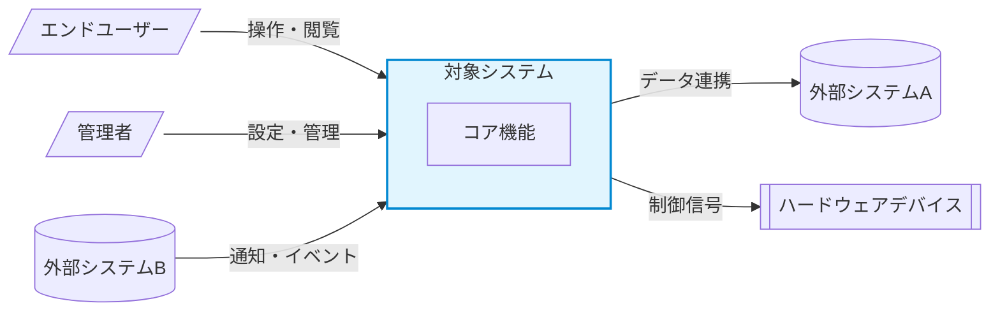
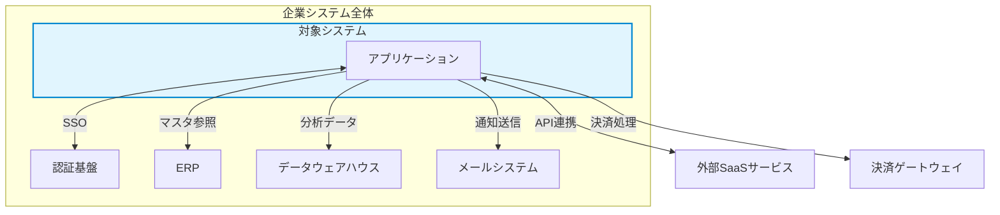

# System Context Diagram

> 参考: Karl Wiegers "Software Requirements 3rd Edition" Chapter 5 - Scope Representation Techniques

## ドキュメント情報

| 項目 | 内容 |
| --- | --- |
| プロジェクト名 | [プロジェクト名] |
| バージョン | 1.0 |
| 作成日 | YYYY-MM-DD |

---

## 目的

コンテキスト図はシステムの境界と外部エンティティ（ユーザー、ハードウェアデバイス、他システム）とのインターフェースを定義する。何がシステムの「中」で、何が「外」かを明確にし、スコープの合意形成に使用する。

---

## コンテキスト図

---

## 外部エンティティ一覧

| エンティティID | 名称 | 種別 | やり取りの内容 | データ/プロトコル | 方向 |
| --- | --- | --- | --- | --- | --- |
| EXT-001 | [エンドユーザー] | ユーザー | [操作内容] | HTTP/ブラウザ | 双方向 |
| EXT-002 | [管理者] | ユーザー | [管理操作] | HTTP/ブラウザ | 双方向 |
| EXT-003 | [外部システムA] | ソフトウェア | [データ連携内容] | REST API / JSON | システム -> 外部 |
| EXT-004 | [外部システムB] | ソフトウェア | [イベント受信] | Webhook / JSON | 外部 -> システム |
| EXT-005 | [ハードウェア] | デバイス | [制御内容] | [プロトコル] | システム -> 外部 |

---

## エコシステムマップ

より広い視点で、対象システムと周辺システム群の関係を示す。

---

## インターフェース概要

各外部エンティティとのインターフェースの概要。詳細はSRSのセクション5「External Interface Requirements」に記載する。

| IF-ID | 接続先 | 方式 | データ形式 | 頻度 | SRS参照 |
| --- | --- | --- | --- | --- | --- |
| IF-001 | [接続先] | [REST/SOAP/MQ/ファイル] | [JSON/XML/CSV] | [リアルタイム/バッチ] | SRS 5.x |

---

## 変更履歴

| バージョン | 日付 | 変更者 | 変更内容 |
| --- | --- | --- | --- |
| 1.0 | YYYY-MM-DD | [氏名] | 初版作成 |
